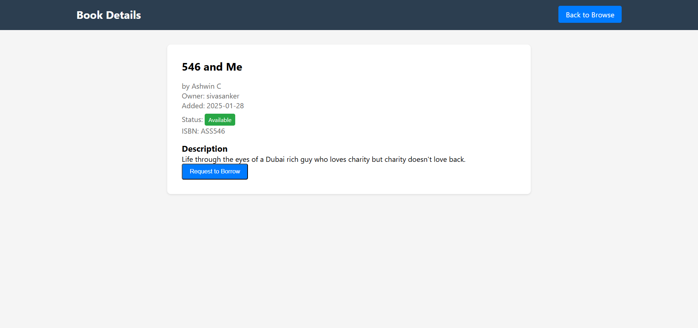

# Simple Book Lending App with Flask & SQLAlchemy

A scrappy Flask app that lets users borrow and lend books from fellow bookworms. It’s not polished, but it gets the job done. Built to dust off some old coding skills and fueled by caffeine, quick hackery and a little bit of magic. It's like a digital bookshelf that doesn't judge you for skipping a few features - cause it doesn't have any ¯\\_(ツ)_/¯

# Screenshots 

## User authentication

## Dashboard

## Add, edit & delete a book

## Browse & search books by other users

## Request a book

## View & approve requests from other users

## View & return borrowed books

# References

- [Securing Your Flask Application: Hashing Passwords Tutorial](https://dev.to/goke/securing-your-flask-application-hashing-passwords-tutorial-2f0p)

- [How to Use Flask-SQLAlchemy to Interact with Databases in a Flask Application](https://www.digitalocean.com/community/tutorials/how-to-use-flask-sqlalchemy-to-interact-with-databases-in-a-flask-application)

# Dependencies

- [Flask](https://flask.palletsprojects.com/en/stable/)

- [python-dotenv](https://pypi.org/project/python-dotenv/)

- [Flask-WTF](https://flask-wtf.readthedocs.io/en/1.2.x/)

- [Flask-SQLAlchemy](https://flask-sqlalchemy.readthedocs.io/en/stable/)
